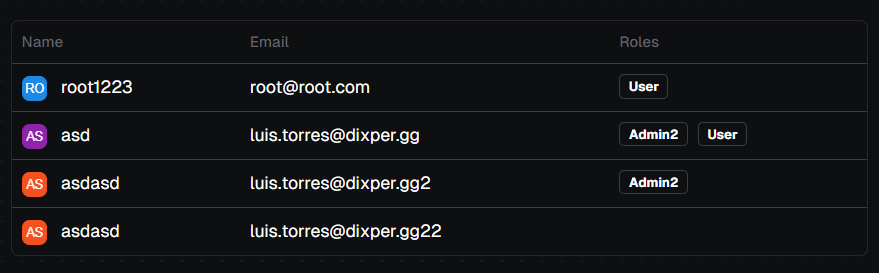
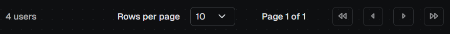
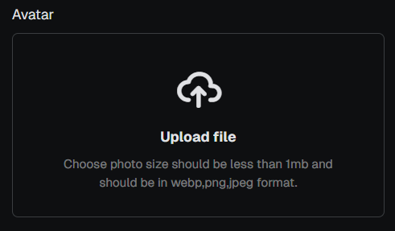
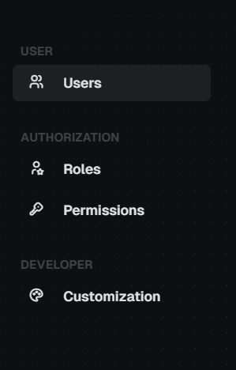

# NGX Bootstrap Components

This library provides a set of Angular components integrated with Bootstrap, designed to be used with Angular's latest features like signals and the OnPush change detection strategy. The components are standalone, meaning they can be imported directly without the need for an encompassing Angular module.

## 🚀 Installation

To use NGX Bootstrap Components in your project, install the package via npm:

```
npm install @dotted-labs/ngx-bootstrap-components
```

## 📖 Components Index

- **Table**: A component that displays tabular data. [Read more
  
  ](./projects/ngx-bootstrap-components/table/README.md)

- **Pagination**: A component that displays a set of pages, with a current page indicator and navigation buttons. [Read more
  
  ](./projects/ngx-bootstrap-components/pagination/README.md)

- **Image Input**: A component that allows users to select and preview images. [Read more
  
  ](./projects/ngx-bootstrap-components/img-input/README.md)

- **Side Bar**: A component that displays a side bar with a list of links. [Read more
  
  ](./projects/ngx-bootstrap-components/side-bar/README.md)

## 🛡️ License

Arcane Auth is licensed under the MIT License - see the [LICENSE](./LICENSE) file for details.

## 🧑‍💻 Contributing

We have a [contributing guideline](./CONTRIBUTING.md) available. Feel free to contact us before coding.
