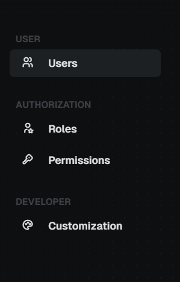

### SideBar Component



The `SideBarComponent` is a component that is used to display a side bar with a menu of links. It supports dynamic changes through Angular signals and adheres to the OnPush change detection strategy for performance optimization.

- **Inputs:**

  - `menu`: Array of menu items for navigation with [DtlSideBarMenu](./src/interfaces/side-bar-menu.interface.ts) type.
  - `currentUrl`: The current URL of the application.

- **Outputs:**
  - `onNavigate`: Emits the path of the newly selected menu item with [DtlSideBarItem](./src/interfaces/side-bar-item.interface.ts) type.

#### Example Usage

To integrate the `SideBarComponent` in your Angular application, you can use the following HTML snippet:

```ts
import { DtlSideBarComponent } from '@dotted-labs/ngx-bootstrap-components/side-bar';

const menu: DtlSideBarMenu = [
  {
    title: 'Dashboard',
    items: [{ name: 'Dashboard', url: '/dashboard', icon: 'bi bi-dashboard', active: true }],
  },
];

export class DashboardComponent implements OnInit {
  public currentUrl = signal<string>('');

  ngOnInit() {
    this.currentUrl.set(this.#router.url);
    this.#router.events.subscribe((event) => {
      if (event instanceof NavigationEnd) {
        this.currentUrl.set(event.url);
      }
    });
  }
}
```

```html
<dtl-side-bar [menu]="menu" [currentUrl]="currentUrl()" (onNavigate)="onNavigate($event)"> </dtl-side-bar>
```
