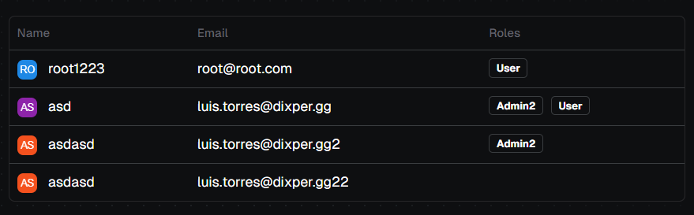

### Table Component



The `DtlTableComponent` displays tabular data and includes features like skeleton screens for loading states, error handling, and empty states, all managed via Angular signals.

- **Inputs:**
  - `items`: Array of items to be displayed in the table.
  - `columns`: Array of column headers.
  - `isLoaded`: Boolean signal indicating if data is fully loaded.
  - `isLoading`: Boolean signal indicating if data is currently loading.
  - `isEmpty`: Boolean signal indicating if there are no data items to display.
  - `error`: Signal for error messages.
  - `skeletonRows`: Number of skeleton rows to display during loading.
  - `rowTemplate`: Template for rendering table rows.

#### Example Usage

To integrate the `DtlTableComponent` in your Angular application, you can use the following HTML snippet:

```ts
import { DtlTableComponent } from '@dotted-labs/ngx-bootstrap-components/table';
```

```html
<dtl-table
  [items]="items$ | async"
  [columns]="columns"
  [isLoaded]="isLoaded$ | async"
  [isLoading]="isLoading$ | async"
  [isEmpty]="isEmpty$ | async"
  [error]="error$ | async"
  [skeletonRows]="skeletonRows"
  [rowTemplate]="rowTemplate"
></dtl-table>
```
